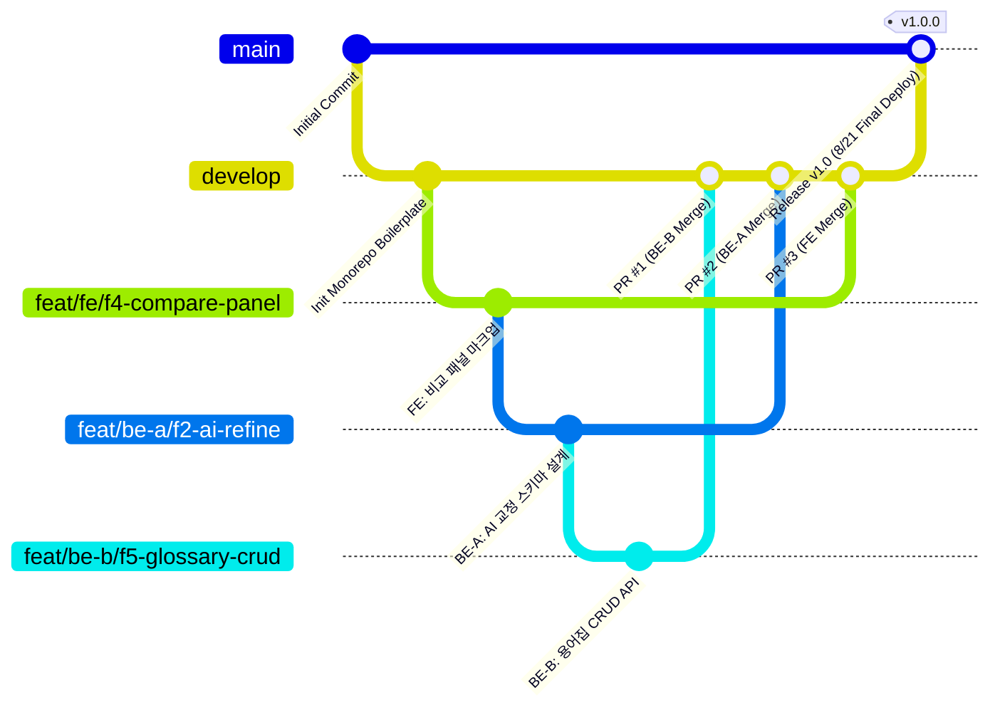
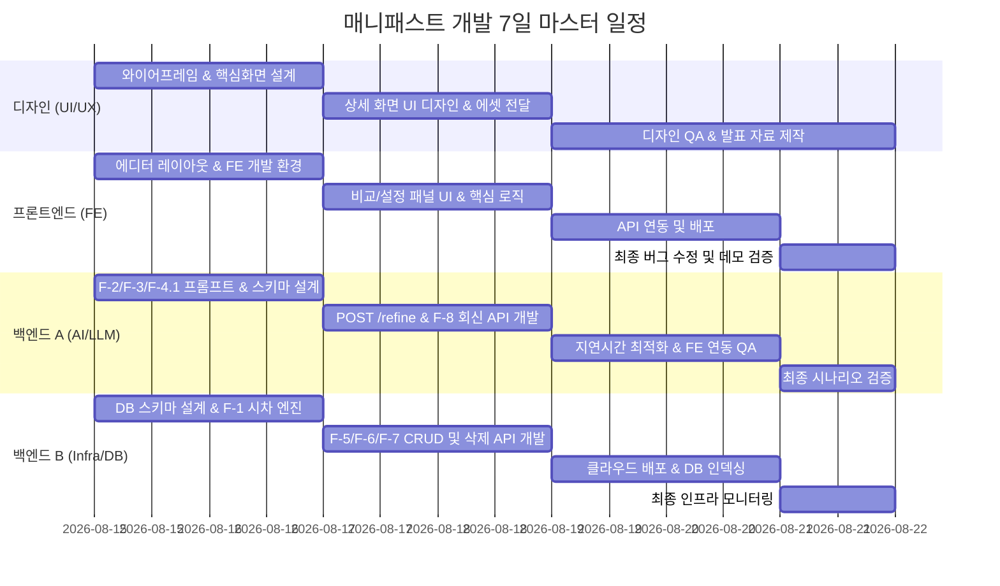

# 📅 매니패스트 스펙 중심 초단기 해커톤 프로젝트 계획 및 역할 분담

본 계획서는 마감일인 **8월 21일(금)**까지 남은 7일 동안 **디자이너 1명, 프론트엔드 1명, 백엔드 2명(총 4명)**의 한정된 리소스로 매니패스트 핵심 기능을 완수하기 위한 타임라인, 기능별 R&R 및 **GitHub 협업 전략** 문서입니다.

---

## 1. 👥 팀원 R&R (역할 분담)

### 🎨 디자이너 (1명)
* **담당 분야**: UI/UX 디자인, 기획 에디터 와이어프레임 설계, 디자인 시스템 빌드, 데모 데크 제작
* **핵심 과제**:
  1. 원문-교정안 비교 및 수정 사유 노출 레이아웃 설계 (F-4)
  2. 기획 에디터 메인 화면 및 개인 설정(성향, 용어집, 규칙) 패널 설계 (F-5, F-6)
  3. 시차/업무시간 외 및 누락 정보 경고에 대한 시각 피드백 설계 (F-1, F-2)

### 💻 프론트엔드 개발자 (1명)
* **담당 분야**: 에디터 웹 어플리케이션 구축, 상태 관리, 시각 효과 하이라이팅, API 연동 및 배포
* **핵심 과제**:
  1. React/Vite 기반 웹 에디터 및 레이아웃 구현
  2. 원문-수정문 비교 뷰 및 최종 승인/복사 인터랙션 구현 (F-4)
  3. 로컬 시간대 연산 및 비업무 시간 가이드 처리 (F-1)
  4. 규칙/용어집 CRUD 및 오해 표현 하이라이트 UI 연동 (F-2, F-5)

---

## 2. 🧩 백엔드 2인 기능별 상세 분담표 (Backend Functional Breakdown)

백엔드 2인은 **[백엔드 A: AI 지능형 분석/생성 엔진]**과 **[백엔드 B: 데이터 관리/도메인 비즈니스 서버]**로 역할을 명확히 양분하여 독립적이면서도 유기적인 개발을 진행합니다.

```
                  ┌──────────────────────────────────────────────┐
                  │              프론트엔드 (React Web)            │
                  └──────────────┬───────────────────────────────┘
                                 │
           ┌─────────────────────┴─────────────────────┐
           ▼                                           ▼
┌──────────────────────────────────────┐  ┌──────────────────────────────────────┐
│  🧠 백엔드 A (AI / LLM 엔지니어링)   │  │ ⚙️ 백엔드 B (인프라 / DB / CRUD)    │
│  - F-2 핵심 정보 분석 & 오해 탐지    │  │  - F-1 시차/시간대 연산 엔진       │
│  - F-3 맥락 교정 & 누락 보완 문구    │  │  - F-5 용어집 & 규칙 관리 CRUD     │
│  - F-4.1 변경점 & 수정 이유 추출     │  │  - F-6 협업 성향 설정 CRUD         │
│  - F-8 수신 메시지 회신 초안 생성    │  │  - F-7 메시지 데이터 보관 및 영구삭제│
│  - Structured Output JSON 스키마     │  │  - DB 스키마 설계 & 클라우드 서버배포│
└──────────────────┬───────────────────┘  └──────────────────┬───────────────────┘
                   │                                         │
                   └──────────────────┬──────────────────────┘
                                      ▼
                        [데이터 통합 및 API 게이트웨이]
```

### 🧠 백엔드 A: AI 지능형 분석 및 생성 엔진 담당 (AI Specialist)
> **핵심 미션**: 비정형 텍스트를 LLM으로 분석하여 핵심 업무 정보 추출, 교정안 생성, 수정 이유 도출 및 회신 초안을 1회 호출(Structured Output)로 고속 반환.

| 담당 기능 ID | 기능 명칭 | 상세 구현 내용 | 담당 엔드포인트 / 산출물 |
| :--- | :--- | :--- | :--- |
| **F-2** | **핵심 업무 정보 분석 및 오해 탐지** | • 목적, 기한, 담당자, 긴급도 식별 및 원문 근거 매핑<br>• 기한/담당자 누락 여부 플래그 판정<br>• 오해 유발 표현(직설적 비난 등) 탐지 및 사유 생성 | `POST /api/ai/analyze-refine` (통합 AI 호출) |
| **F-3** | **맥락 기반 교정 & 누락 보완 문구 제안** | • 백엔드 B로부터 전달받은 규칙/성향/용어집을 프롬프트에 주입해 맞춤 교정본 생성<br>• 핵심 정보 보존성 검증<br>• 누락 정보 보완용 플레이스홀더 문구 생성 | `POST /api/ai/analyze-refine` 내부 로직 |
| **F-4.1** | **원문·수정안 변경점 및 수정 이유 도출** | • 원문 대비 수정문의 단어/문장 차이점 및 수정 이유(Reasoning)를 구조화된 JSON으로 반환 | `POST /api/ai/analyze-refine` (`changes[]`, `reason` 필드) |
| **F-8** | **수신 메시지 기반 회신 초안 생성** | • 수신 메시지의 요청 사항 파악<br>• 수락/거절/일정조율 등 대응 방향별 3가지 회신 초안 자동 생성<br>• 부족한 정보 영역에 `[ ]` 플레이스홀더 삽입 | `POST /api/ai/reply-draft` |
| **공통** | **AI 파이프라인 최적화** | • OpenAI Structured Outputs (JSON Schema) 정의<br>• Prompt Caching 적용 및 응답 Latency 단축(최대 3초 이내)<br>• 토큰 사용량 최적화 | 시스템 프롬프트 및 스키마 명세서 |

---

### ⚙️ 백엔드 B: 인프라, DB 및 데이터 라이프사이클 담당 (Core Backend & DB)
> **핵심 미션**: 사용자 설정(규칙, 용어집, 성향)과 시차 연산, 메시지 이력 보관 및 사용자 주도의 영구 삭제(Lifecycle)를 안정적으로 처리하는 API 서버 구축.

| 담당 기능 ID | 기능 명칭 | 상세 구현 내용 | 담당 엔드포인트 / 산출물 |
| :--- | :--- | :--- | :--- |
| **F-1** | **시차 환산 및 비업무 시간(off-hours) 판정** | • 발신자/수신자 타임존 기준 날짜/시간/마감 기한 상호 환산<br>• 수신자 현지 비업무 시간대(야간, 주말) 감지 및 확인 가능 시점 산출 API | `POST /api/timezone/convert`<br>`POST /api/timezone/check-offhours` |
| **F-5** | **커뮤니케이션 규칙 및 용어집 관리** | • 개인 규칙 및 용어집의 CRUD API 개발<br>• 백엔드 A의 AI 요청 시 주입할 용어집/규칙 데이터 포맷팅 및 제공<br>• 용어 팝업 열람용 조회 API | `GET/POST/PUT/DELETE /api/rules`<br>`GET/POST/PUT/DELETE /api/glossaries` |
| **F-6** | **개인 협업 성향 설정 관리** | • 기본 협업 성향 CRUD API<br>• 메시지 작성 시 임시 성향 오버라이드 파라미터 처리 | `GET/PUT /api/user/collaboration-style` |
| **F-7** | **메시지 데이터 보관 및 삭제 제어** | • 저장된 메시지 데이터 보관 현황 및 통계 조회<br>• 개별 메시지 작업 이력 영구 삭제 및 전체 초기화 API<br>• 데이터 보관 만료 정책(TTL) 백그라운드 스케줄러 | `GET /api/messages/history`<br>`DELETE /api/messages/:id`<br>`DELETE /api/messages/all` |
| **공통** | **인프라 및 서버 배포** | • DB 스키마 설계 (PostgreSQL / Firestore 등) 및 인덱싱<br>• 클라우드 서버 호스팅 배포 (Render / Fly.io / Vercel 등)<br>• CORS 설정, 인증/보안 미들웨어 및 예외 처리 | 배포된 API 서버 URL 및 DB 인스턴스 |

---

## 3. 🐙 GitHub 협업 구조 및 워크플로우 (GitHub Strategy)

7일간의 빠른 개발 속도와 충돌(Conflict) 방지를 위해 **단일 모노레포(Monorepo) 구조**와 **간소화된 브랜치 전략(GitHub Flow 변형)**을 채택합니다.

### 3.1. 모노레포 디렉토리 구조 (Repository Layout)
```
manyfast-project/
├── .github/
│   ├── workflows/             # GitHub Actions (CI 빌드 및 자동 배포)
│   └── PULL_REQUEST_TEMPLATE.md
├── client/                    # 💻 프론트엔드 작업 영역 (React + Vite)
│   ├── src/
│   │   ├── components/        # 에디터, 비교패널, 설정창
│   │   ├── hooks/
│   │   └── api/               # 백엔드 API 클라이언트
│   └── package.json
├── server/                    # ⚙️ 백엔드 작업 영역 (Node.js / Python)
│   ├── src/
│   │   ├── ai/                # 🧠 백엔드 A: 프롬프트, OpenAI SDK, F-2/F-3/F-8
│   │   ├── domain/            # ⚙️ 백엔드 B: 규칙, 용어집, 성향, F-1/F-5/F-6
│   │   ├── history/           # ⚙️ 백엔드 B: 데이터 보관 및 삭제, F-7
│   │   └── index.js           # 통합 라우터 및 미들웨어
│   └── package.json
├── docs/                      # 🎨 디자이너 & 공통 문서 (피그마 링크, API 명세, 발표자료)
└── README.md
```

---

### 3.2. 브랜치 전략 (Branching Model)



1. **`main` (운영/배포 브랜치)**:
   - 언제든 배포 가능한 상용 빌드 브랜치 (Vercel/Render 자동 배포 연동).
   - 마감 직전 `develop`에서 최종 병합.
2. **`develop` (통합 개발 브랜치)**:
   - 4명의 작업물이 모여 실시간 연동 테스트를 진행하는 메인 베이스 브랜치.
3. **`feat/{역할}/{기능명}` (작업 기능 브랜치)**:
   - `feat/fe/f4-compare-panel` (FE: 원문-교정안 비교 UI)
   - `feat/be-a/f2-ai-refine` (BE-A: AI 교정 및 이유 도출)
   - `feat/be-b/f5-glossary-crud` (BE-B: 용어집/규칙 CRUD)
   - `feat/be-b/f1-timezone` (BE-B: 시차/비업무시간 연산)
   - `feat/design/figma-assets` (Design: 디자인 에셋 및 CSS 토큰)
4. **`fix/{버그명}` (긴급 수정 브랜치)**: 연동 중 발견된 오류 핫픽스.

---

### 3.3. 커밋 컨벤션 (Commit Convention)
일관된 작업 추적을 위해 **Conventional Commits** 표준을 따릅니다:

| 접두사 | 용도 | 예시 |
| :--- | :--- | :--- |
| `feat:` | 새로운 기능 개발 | `feat(ai): F-2 핵심 업무 정보 및 오해 표현 감지 로직 추가` |
| `fix:` | 버그 수정 | `fix(timezone): KST-EST 서머타임 환산 오차 수정` |
| `docs:` | 문서 작성 및 수정 | `docs(api): F-8 회신 초안 생성 API 엔드포인트 명세 추가` |
| `style:` | 코드 포맷팅, UI 스타일 변경 | `style(fe): 비교 패널 변경점 하이라이트 CSS 색상 적용` |
| `refactor:`| 기능 변화 없는 코드 리팩토링 | `refactor(be-b): 용어집 DB 쿼리 인덱싱 최적화` |
| `test:` | 테스트 코드 작성 및 검증 | `test(ai): Structured Outputs JSON 응답 유효성 테스트` |

---

### 3.4. PR (Pull Request) 및 코드 리뷰 룰
* **빠른 머지 룰 (초단기 해커톤 특화)**:
  1. 모든 PR은 `develop`을 타겟으로 생성합니다.
  2. 최소 **1명 이상의 Approve**가 있으면 머지 가능합니다.
  3. 상대 파트와의 충돌을 막기 위해 머지 전 반드시 `git pull origin develop`으로 로컬 최신화 후 충돌을 해결하고 PR을 올립니다.
* **PR 템플릿**:
  ```markdown
  ## 📌 관련 이슈 / 기능 ID
  - Closes #12 (F-2, F-3)

  ## 🛠 작업 내용
  - OpenAI Structured Outputs 기반 교정 API 구현
  - 기한, 담당자 누락 판정 필드 추가

  ## 📸 테스트 결과 / 스크린샷
  - Postman 요청/응답 캡처 첨부 (또는 UI 화면)

  ## ⚠️ 다른 파트 전달 사항 (FE/BE 공지)
  - `POST /api/ai/analyze-refine` 요청 바디에 `targetLang` 필드가 필수로 추가되었습니다.
  ```

---

### 3.5. GitHub Issues & Projects (칸반 관리)
* **GitHub Projects (칸반 보드)** 활용:
  - 컬럼 구성: `📋 To Do` ➔ `🚧 In Progress` ➔ `👀 In Review (PR)` ➔ `✅ Done`
* **Issue 레이블 (Labeling)**:
  - 역할: `role:fe`, `role:be-a`, `role:be-b`, `role:design`
  - 기능: `spec:F-1`, `spec:F-2`, `spec:F-3`, `spec:F-4`, `spec:F-5`, `spec:F-6`, `spec:F-7`, `spec:F-8`
  - 우선순위: `P0 (블로커)`, `P1 (필수)`, `P2 (선택)`

---

## 4. 📅 7일간의 스프린트 타임라인 (8/15 ~ 8/21)



### [D-7 ~ D-6] 8월 15일 ~ 16일: 설계 및 프로토타이핑 (보일러플레이트 구축)
* **디자이너**: 에디터 메인 화면 및 비교 뷰(F-4) 와이어프레임 완성.
* **프론트엔드**: React/Vite 프로젝트 구성, 기본 에디터 레이아웃 마크업 및 라우팅 구성.
* **백엔드 A**: 핵심 정보 식별(F-2), 교정안 생성(F-3), 수정 이유 도출(F-4.1)용 JSON Schema 및 System Prompt 설계/테스트.
* **백엔드 B**: DB 스키마 설계(규칙, 용어집, 성향, 이력), F-1 시차/비업무시간 계산 로직 작성 및 서버 보일러플레이트 세팅.

### [D-5 ~ D-4] 8월 17일 ~ 18일: 핵심 기능 집중 개발 (기능 완성도 70%)
* **디자이너**: 세부 UI 요소(시간대 위젯, 용어 하이라이트 팝업 등) 최종 디자인 완료 및 FE에 피그마 에셋 전달.
* **프론트엔드**: 원문-수정문 비교 패널 구현, 로컬 시차 환산 UI 개발, 용어집 및 협업 성향 관리 뷰 구현.
* **백엔드 A**: `POST /api/ai/analyze-refine` 완성, F-8 수신 메시지 회신 초안 생성 API (`POST /api/ai/reply-draft`) 구현.
* **백엔드 B**: F-5 규칙/용어집 CRUD API, F-6 협업 성향 CRUD API, F-7 메시지 데이터 보관 및 영구 삭제 API 개발 완료.

### [D-3 ~ D-2] 8월 19일 ~ 20일: 통합(Integration) 및 배포
* **디자이너**: 발표자료(PPT/Deck) 작성 및 데모 영상 기획, 디자이너 관점에서의 UI QA 리스트업.
* **프론트엔드**: 백엔드 A/B API 전체 연동 진행, 에디터 직접 수정/승인/복사 동작 디버깅, 호스팅 서버 배포.
* **백엔드 A**: AI 모델 튜닝을 통해 프롬프트 캐싱 적용 및 교정 응답 속도 단축 (Latency 최적화), FE 연동 지원.
* **백엔드 B**: 백엔드 API 서버 실배포, DB 인덱싱 적용 및 CORS 환경 설정 완료, 백엔드 A와의 데이터 연계 검증.

### [D-1] 8월 21일: 최종 검증 및 마감 (Submit & Demo Setup)
* **전체 팀원**: 배포 환경에서 프로덕션 빌드 후 실제 유스케이스 기반 최종 E2E 데모 시나리오 검증.
* 발견된 마이너 버그 핫픽스, 최종 발표자료 점검 및 최종 제출 완료.
